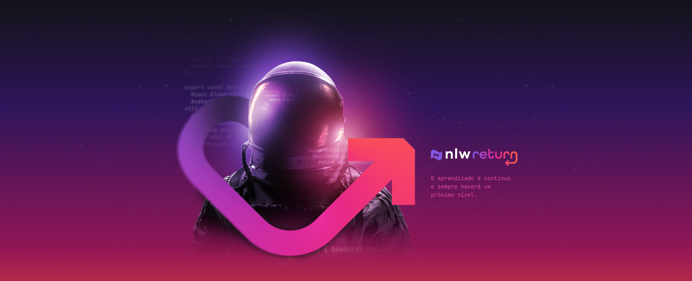

# Next Level Week #8: Return

Evento da Rocketseat - 02 a 06 de maio de 2022

## Projeto pronto e funcionando

[Clique aqui](https://nlw-return-impulse-vitorhonna.vercel.app/)

## Trilha Impulse

[Layout do Projeto](https://www.figma.com/community/file/1102912516166573468/Feedback-Widget)

[Material Complementar](https://efficient-sloth-d85.notion.site/Impulse-58f2daadb8e1433894420cbc57571087)

[Videos](https://nextlevelweek.com/episodios/impulse/aula-1/edicao/8)

<!-- ❌✔️ -->

- ✔️ 01/mai/21 - Abertura
- ✔️ 02/mai/21 - Stage 1 (1h48) - Front-end (React)
- ✔️ 03/mai/21 - Stage 2 (1h57) - Front-end (React)
- ✔️ 04/mai/21 - Stage 3 (2h00) - Back-end (Node.js)
- ✔️ 05/mai/21 - Stage 4 (2h09) - Mobile (React Native)
- ✔️ 06/mai/21 - Stage 5 (0h56) - Deploy (Vercel + Railway)
- ✔️ 08/mai/21 - Encerramento
